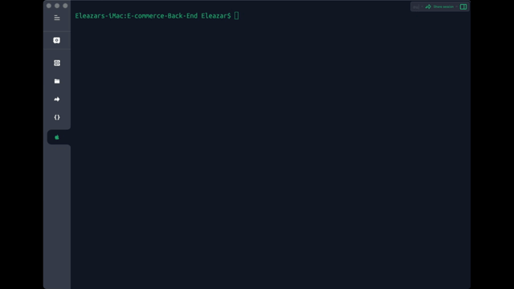

# E-commerce-Back-End
Back end for an e-commerce site. Based on a working Express.js API and configured it to use Sequelize to interact with a MySQL database.

## Table of Contents
* [Description](#description)
* [Install](#install)
* [Use](#use)

## Description
Internet retail, also known as e-commerce, is the largest sector of the electronics industry, having generated an estimated US$29 trillion in 2017 (Source: United Nations Conference on Trade and Development). E-commerce platforms like Shopify and WooCommerce provide a suite of services to businesses of all sizes. Due to the prevalence of these platforms, developers should understand the fundamental architecture of e-commerce sites. Your challenge is to build the back end for an e-commerce site. You’ll take a working Express.js API and configure it to use Sequelize to interact with a MySQL database.

## Install
* Clone the project source code

* To verify Node.js installation, type "node -v" in your command line. If Node is absent, access the Node.js website for installation. Run the following line of code in your terminal to install all the needed packages: 
```
npm i 
```

* Connect to MySQL database with your own database credentials
```
mysql -u root -p
``` 

* Create the database schema
```
source db/schema.sql;
```


* Exit the database
```
mysql> exit
```

* Seed the database from the command line.
```
npm run seed
```


* Start the application’s server and syncs sequelize models to a MySQL database on the server start.
```
npm start
```



## Use
* After installing all the required packages, launch your terminal and execute the following command in the command line:
```
$ npm start
```
* The following animations demonstrate the testing of the application's API routes using Insomnia Core.


View a [video]() demonstration showcasing the fundamental features.